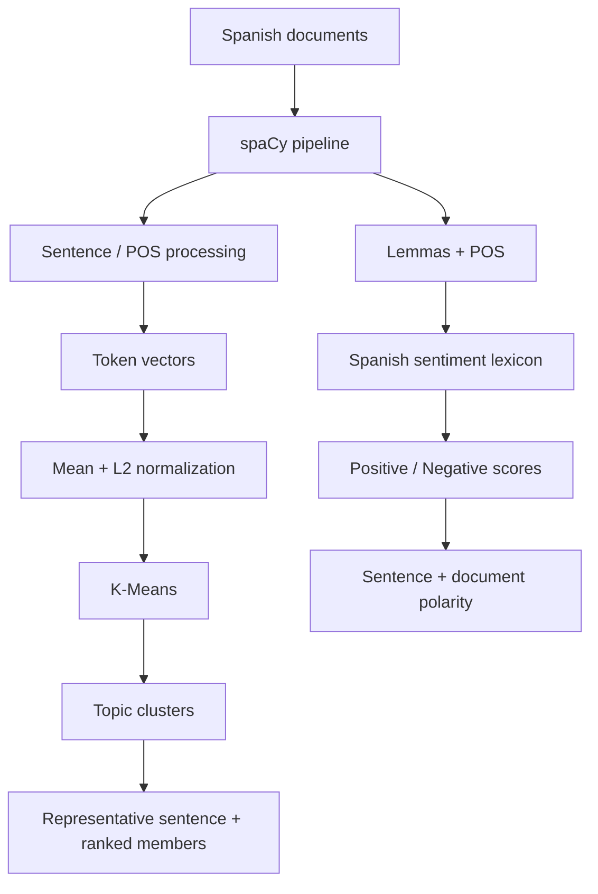

# Spanish NLP Toolkit

A modernized Spanish-language NLP project for **topic clustering** and **lexical sentiment analysis**.

This project consolidates earlier topic-detection and polarity-analysis experiments into one cohesive, testable toolkit while preserving the classical NLP approach:

- **Topic detection:** spaCy linguistic processing + sentence vectors + K-Means.
- **Sentiment analysis:** Spanish SentiWordNet-style lexical scores over lemmatized Spanish text.

This is the maintained implementation of the project.

## Why this project is useful

The goal is not to replace every classical NLP component with an LLM. Instead, this repository exposes a transparent baseline whose behavior can be inspected, reproduced, measured, and later compared with transformer-based approaches.

## Architecture



## Modernization highlights

### One toolkit instead of duplicated microservices

The original project ran topic detection and polarity as separate Flask applications with duplicated configuration and request models.

The new version provides one FastAPI application:

- `POST /topics`
- `POST /sentiment`
- `GET /health`

### Deterministic topic clustering

The original K-Means initialization did not set `random_state`, so clusters could vary between runs.

This version uses an explicit seed and multiple initializations:

```python
KMeans(
    n_clusters=n_topics,
    n_init=10,
    random_state=random_state,
)
```

Scikit-learn documents `random_state` as the control for deterministic centroid initialization and supports repeated initializations through `n_init`.

### Correct sentence-vector aggregation

The original implementation accumulated selected token vectors and then divided the result by the **number of characters in the sentence**.

The modernization uses:

1. selected NOUN / PROPN / VERB token vectors
2. arithmetic mean across token vectors
3. L2 normalization before clustering

This is an intentional algorithmic correction and may produce different clusters from the historical implementation.

### More informative topic output

Instead of returning only lists of sentences, every topic includes:

- cluster id
- representative sentence nearest the centroid
- every member sentence
- distance to the centroid

### Explicit sentiment output

Sentiment results expose:

- `positive`
- `negative`
- `net = positive - negative`

They can be returned both at document and sentence level.

### No import-time model loading

spaCy models and lexicon resources are loaded only when needed. This improves startup behavior and allows unit tests to exercise the numerical core without downloading external language models.

## Project structure

```text
.
├── app.py
├── src/spanish_nlp/
│   ├── config.py
│   ├── resources.py
│   ├── runtime.py
│   ├── schemas.py
│   ├── sentiment.py
│   └── topic.py
├── tests/
│   ├── test_resources.py
│   ├── test_sentiment.py
│   └── test_topic.py
├── .env.example
└── pyproject.toml
```

## Setup

Requires Python 3.11+.

```bash
python -m venv .venv
source .venv/bin/activate        # macOS/Linux
# .venv\Scripts\activate       # Windows

pip install -e ".[dev]"
python -m spacy download es_core_news_md
cp .env.example .env
```

Run the API:

```bash
uvicorn app:app --reload
```

FastAPI exposes interactive API documentation at `/docs`.

## Topic detection

Example request:

```json
{
  "documents": [
    "El equipo ganó el partido después de una gran segunda parte.",
    "Los mercados europeos cerraron con pérdidas.",
    "El delantero marcó dos goles.",
    "La inflación volvió a afectar a los mercados."
  ],
  "n_topics": 2
}
```

The endpoint vectorizes individual sentences and returns clusters ordered internally by distance to each centroid.

## Sentiment analysis

Set `SWN_PATH` to a compatible Spanish SentiWordNet-style TSV resource:

```text
word<TAB>pos positive negative
```

Example:

```text
bueno    a 0.75 0.0
malo     a 0.0 0.8
```

Then:

```json
{
  "documents": [
    "La experiencia fue buena, aunque el servicio fue malo."
  ],
  "include_sentences": true
}
```

## Resource provenance

Earlier experiments used a Spanish SentiWordNet resource and custom Spanish stop-word lists. Those third-party resources are **not** bundled in this maintained project.

Before extracting this project into its final standalone repository, the provenance and redistribution terms of third-party lexical resources should be verified. The code therefore accepts the lexicon path through configuration rather than embedding the resource into the package.

## Configuration

| Variable | Purpose | Default |
|---|---|---|
| `SPACY_MODEL` | Spanish spaCy pipeline | `es_core_news_md` |
| `SWN_PATH` | Spanish sentiment lexicon | unset |
| `STOPWORDS_PATH` | Optional custom stop-word file | unset |
| `RANDOM_STATE` | Reproducible clustering seed | `42` |

When `STOPWORDS_PATH` is unset, spaCy's built-in Spanish stop-word set is still used.

## Quality checks

```bash
ruff check .
pytest -q
```

The tests cover:

- deterministic K-Means grouping
- centroid-distance ranking
- invalid cluster counts
- lexicon parsing
- text → lemma fallback
- polarity averaging
- neutral unknown terms

They do not require a downloaded spaCy model.

## Historical issues corrected

The modernization also resolves several implementation problems in the original code:

- the polarity Flask service used `if __name__ == '__name__'` and therefore did not start when executed normally
- K-Means had no deterministic seed
- broad bare `except:` blocks masked unrelated errors
- debugging `print()` calls were part of core sentiment execution
- topic and sentiment services duplicated infrastructure
- runtime resources were loaded globally during module import
- `__pycache__` directories were committed
- environment configuration lived in a tracked `.env`

## Next research pass

Before this becomes a final portfolio repository, the most valuable additions would be:

- a labelled Spanish topic/sentiment evaluation dataset
- clustering metrics and qualitative topic analysis
- sentiment precision/recall/F1 against labelled examples
- comparison with modern transformer embeddings
- comparison with a transformer sentiment baseline
- error analysis for negation, intensifiers, irony, and domain-specific vocabulary
- API examples and screenshots

That comparison would allow the classical implementation to remain useful as an interpretable baseline rather than being replaced without measurement.
